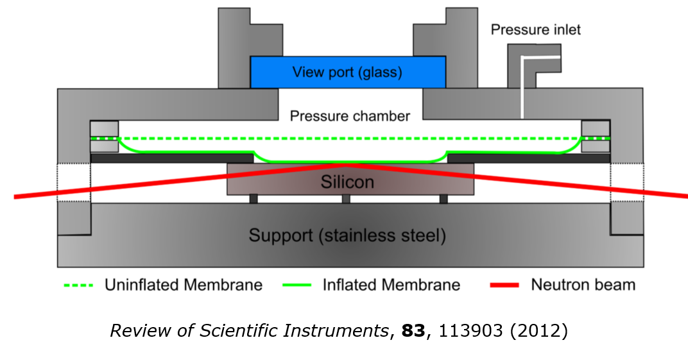
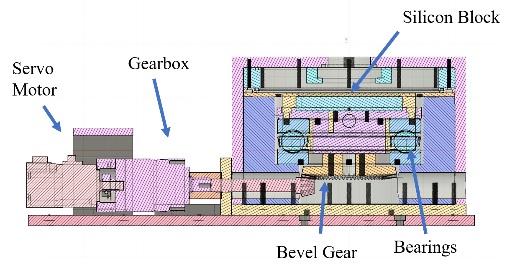
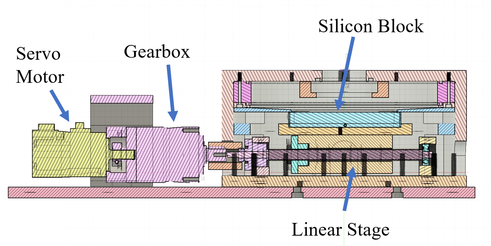
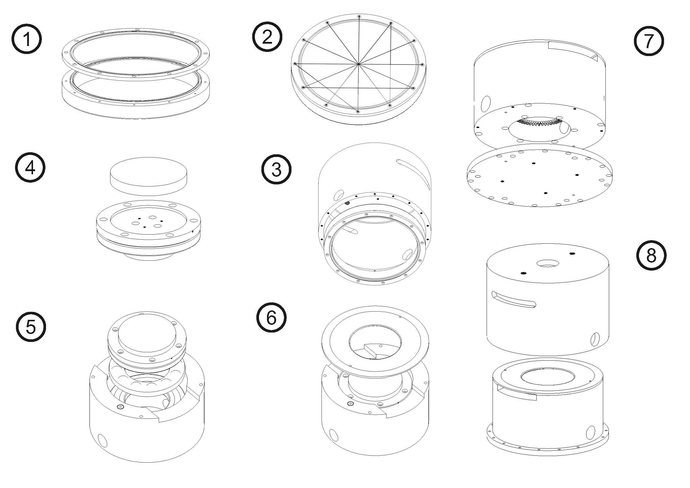
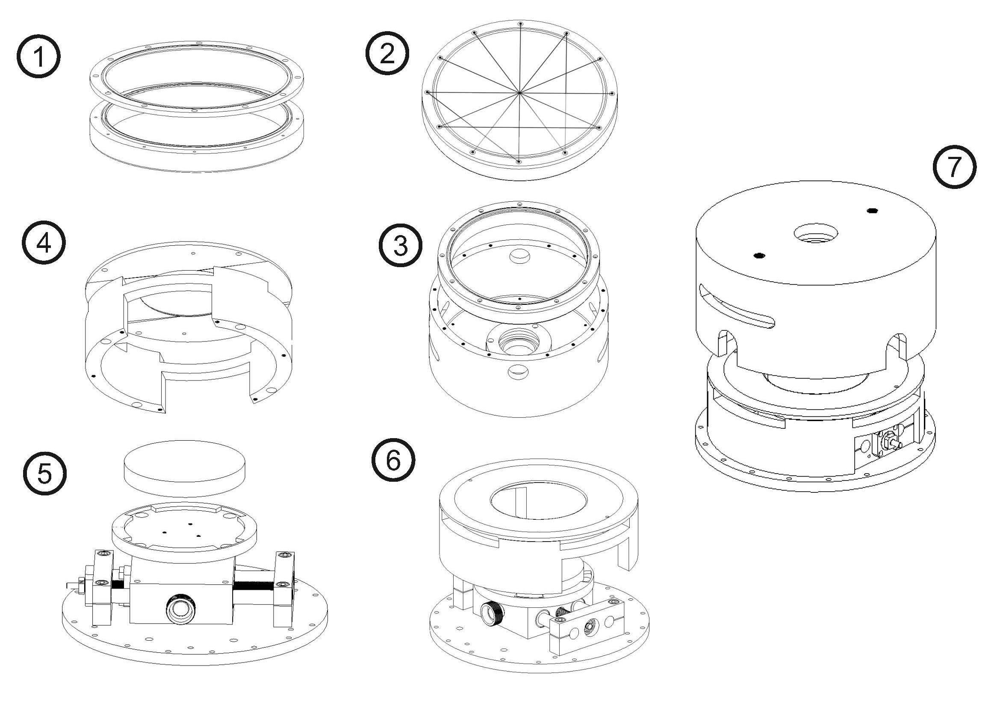

# Linear and Rotational Confinement Shear Cell

## Motivation

The solvent-mediated forces between macromolecular structures at
surfaces are the essence of the physics of adhesion, 
lubrication and many other applications in particle aggregation and coalescence. Surface force apparatus (1970)
and Atomic Force Microscopy have revealed as very useful tools to characterize
the interactions between surfaces. However , in these direct force measurements, 
the structures of the interacting media are not known in detail, 
particularly as the surfaces are compressed or confined. 

In this sense, Neutron Reflection (NR) is a powerful technique to study the structure of thin films at interfaces. 
The development of an instrument capable of measuring confined samples has a long history. The initial approach 
[[1]](#1) was bring two solid surfaces together, with two quartz blocks providing they are parallel surfaces 
and a hydraulic pressure system used to bring the surfaces to within 10-100 nm of each other. 
The pressure required was large (10-150 bar), and strongly dependent of the sample. Other approaches [[2]](#2) also developed a similar confinement cell for neutron reflectometry with a limit
of 80 to 100 nm for the smallest distance between surfaces. This approach also has the possibility to apply steady shear rates from 0.001 to 20 Hz (faster with oscillatory motion). Both
approaches have similar problems: solid surface approach can be limited by any dust present between substrates, 
affecting the pressure distribution across the surfaces; the inherent long range waviness of substrates 
play also a limiting role in the minimum distance between surfaces.

An original approach [[3]](#3) to this problem was able to solve nearly all these problems. 
Using a flexible membrane, Melinex (Polyethylene Terephtalate, DuPont Teijin) as one of the substrates, avoids
the nearly all problems with dust particles and solves the lack of flatness of the surfaces over large interfacial areas and provides
close an even molecular contact between interfaces over a large area.

This setup has been successfully used at a number of studies at ILL and ISIS. 
Within the framework of a collaborative project between Malmö University, 
Kent University, ISIS, ESS and ILL recently funded by the Swedish Research Council 
and the Nordforsk Foundation, this confinement cell have been further developed , 
and implemented the possibility of shearing the opposing surfaces [[4]](#4). 

The determination of the structures of sheared boundary lubricants remains a challenge, 
which results in a lack of understanding of boundary lubrication mechanisms severely 
impeding the rational design of lubricants. This is clear for the case of water based 
lubricants, for which we lack a mechanical understanding. Specifically, different types 
of hydrophilic polymer coatings (e.g., PEO brushes) have been reported to provide 
extraordinary lubricating performance in aqueous solution. This is counterintuitive 
as these soft layers should significantly dissipate friction energy. The developed cell 
will allow this mechanistic understanding and, subsequently, 
the rational design of water based lubricants that could e.g., replace those based on oils.

## Linear and Rotational confinement and shear designs

In the new setup, shear has been implemented modifying the central support of the silicon block. Two
designs were developed for different types of shear:

* Rotational confinement shear cell

* Linear confinement shear cell 

In the rotational design a bevel gear (5:1) has been introduced, thus, decoupling the normal force from the rotational movement. 
The transmission is mediated using a reducer gearbox (100:1) while the movement 
using a servo motor (Mitsubishi). The combined reduction factor of the gearbox and the bevel gear is 500:1. 
This setup allows us to apply relevant shear rates (1-1000s-1). 

###  Rotational Confinement and Shear Cell

The rotational Ofelia (RCC) has the following parts (all the sketched parts can be downloaded from the Design folder):

* NSK ball bearing. In this prototype, part is glued and part can be moved. Use fat to lubricate bearings.
* External case (aluminium)
* Internal case (aluminium)
* Membrane support (stainless steel)
* Top membrane holder (aluminium)
* Bottom membrane holder (aluminium)
* Sample holder (aluminium), it is glued to one part of the NSK ball bearing.
* Case lid (aluminium)
* Bevel gear with pinion, KHK-US-SB1.5-6012. This is a reductor 5:1.
* MAXOS safety glass, 60 mm diameter, 10 mm thickness, 16 bar max pressure (ACI).

In order to mount the system hexagonal socket cap, stainless steel screws should be used:

* 2 M10x1, in the external case. For the experiment they are changed by a quick fit in the inlet and a transducer pressure sensor (KA Sensors) in the outlet.
* 6 M3x30, for the bottom membrane holder.
* 6 M3x6, for the top membrane holder.
* 3 M3x12, for the window.
* 3 wall through M3,  for the sample support.
* 19 M4x25, for the top membrane holder.
* 4 M5x20, for the membrane support.
* 3 M5, for the sample support and Bevel gear.
* 1 M2, for the fix the sample position (needs the 0.9 mm Allen key).

Original modifications where planned for fine threaded screws. As it is difficult to find suppliers for small quantities, the screws
can be exchanged by standard threaded screws.

The setup of the cell should be done following the graph.

### Linear Confinement and Shear cell

The linear Ofelia has the following parts (all the sketched parts can be downloaded from the Design folder):

* Liner stage: it has a square table (85 mm) with four M6 threaded holes. The infinite screw has 2 mm step. The linear stage is the model JM12-S0040-TR-UR, manufactured by AluFlex. The linear stage is already attache to the base using hexagonal nuts.
* External case (aluminium)
* Internal case (aluminium)
* Membrane support (stainless steel)
* Top membrane holder (aluminium), includes Viton O-ring.
* Bottom membrane holder (aluminium), includes Viton O-ring.
* Sample holder (aluminium)
* Case lid (aluminium)
* MAXOS safety glass, 60 mm diameter, 10 mm thickness, 16 bar max pressure (ACI), includes Viton O-ring.

In order to mount the system hexagonal socket cap, stainless steel screws should be used:

* 2 M10x1, in the external case. For the experiment they are changed by a quick fit in the inlet and a transducer pressure sensor (KA Sensors) in the outlet, includes Viton O-ring.
* 6 M3x30, for the bottom membrane holder.
* 6 M3x6, for the top membrane holder.
* 3 M3x12, for the window.
* 19 M4x25, for the top membrane holder.
* 4 M5x20, for the membrane support.
* 4 M6, for the sample support.
* 1 M2, for the fix the sample position (needs the 0.9 mm Allen key).

As before, original modifications where planned for fine threaded screws. As it is difficult to find suppliers for small quantities, the screws
can be exchanged by standard threaded screws.

The setup of the cell should be done following the graph.

## Speed control

The linear and rotational confinement and shear cells requires the same motor: a Mitsubishi HG-K053. The motor could be controlled using the Mitsubishi, Melservo R-J4-10A-RU controller 
and a PLC. This last one is useful to send commands programmatically and to connect the cell in an LAN for intrumentation. Regarding the software, a simple control
was implemented to change speed and direction. The main (avalaible) parameters that affect the Mitsubishi motor are three:

* Resolution ($N_R$)
* Number of command pulses ($N_p\leq 10^6$)
* PLC command pulses ($N_{plc}\leq 2\cdot 10^5$)

However, we will only modify the last two for the experiment. The equation that relates these parameters with the motor speed (in RPM):

$$
s = 60\frac{N_{plc}}{N_p}
$$

In the actual setup, speed is affected by the reduction of the Gearbox (100:1) for both, linear and rotational confinement cells.

### Rotational Confinement Cell Speed

In this particular case, the bevel gear reduces 5 times the speed from the Gearbox, $s_r=s/(500)=3N_{plc}/(25N_p)$. The upper limit of the $s_r$ using the full resolution $(N_p=10^6)$ and the maximum command pulses $(N_{plc} =  2\cdot 10^5)$ is $s_r=0.024$ rpm . At this speed, a complete silicon block revolution will last 41.7 minutes. The theoretical minimum speed is reached when $N_{plc}=1$, that is $s_r = 1.2\cdot 10^{-7}$ rpm. When selecting speed, the following equations will be easier to use (with $s_r$ in rpm) :
$N_{plc} = 25N_p\cdot s_r/3$.

Using the time of the experiment as variable, $25/3\cdot10^6\geq t_{exp}\geq 125/3$ min, we have $N_{plc} = 25N_p/(3t_{exp})$.

### Linear Confinement Cell Speed

Only the gearbox reduces the speed of the motor:

$$
s_\ell = s/(100)=\frac{3N_{plc}}{5N_p}
$$

The upper limit of the $s_\ell$ using the full resolution ($N_p=10^6$) and the maximum command pulses ($N_{plc} =  2\cdot 10^5$) is $s_\ell=0.12$ rpm. At this speed, the silicon block will travel at the speed $v_\ell = 0.24$ (mm/min), where $p$ is the step of the linear stage screw ($p=2$ mm):

$$
v_\ell = p\cdot s_\ell=\frac{6N_{plc}}{5N_p}\ \ (mm/min)
$$

That is, $v_\ell = 4\ \mu$m/s. Supposing we only have 2 mm of travel distance, we need 8.3 minutes to run the full length. 
The theoretical minimum speed is reached when $N_{plc}=1$, $v_l = 0.02\ \mu$m/s. When selecting speed, the following equation will be easier to use (with $v_\ell$ in mm/min):

$$
N_{plc} = 5N_pv_\ell
$$

Using the time of the experiment as variable, $5/3\cdot10^6\geq t_{exp}\geq 25/3\ min$, we have $N_{plc} =5N_p/(3t_{exp})$.

## Setting the  parameter

The  parameter is modified in the webpage 
of the PLC (address 192.168.3.250; the same address should be put in the TCP/IP configuration on the Ethernet adapter, 
with subnet mask 255.255.255.0). In this web page the following parameters can be set:
\begin{itemize}
* M0: binary value (switch direction)
* M1: binary value (forward)
* M2: binary value (backward)
* D1004: 32-bit integer value, in the limits previously cited (speed)

In order to simplify the access and to setup custom programs, a LabView interface has been 
developed (it can be downloaded in the Software folder).

## Pressure Control

A pressure control setup was designed and manufactured in collaboration 
with FluidControls, Ltd. (Bristol, UK). Briefly, the pressure controller consists of a 
pressure valve along with electronics for controlling and monitoring the pressure. 
It also has an inlet that supplies nitrogen or dry air to the pressure valve. 
Gas is then conducted to the outlet and from this point to the confinement-shear cell. 
The pressure measured by the controller is basically the equilibrated pressure between 
the controller and the cell. If the outlet valve is closed and the controller is switched 
off, all the information on the pressure is lost. Also, no information on leaks could 
be directly detected. To overcome this drawback, a pressure sensor (ASH-A1000-4A1-AD-2V-050-000-000, KA -sensors) 
was mounted at the outlet of the cell pressure chamber. This allows users to close the outlet valve from 
the pressure controller and check whether leaks are present in the pressure chamber. At the same time, 
pressure fluctuations could also be registered during an experiment.
In order to control both the pressure controller and the pressure sensor, 
a LabView graphical interface was programmed. In particular, 
the pressure sensor was connected to a microcontroller (Arduino) 
and LabView was used for developing the GUI interface.

## 3D Printed Masks

Thermal neutron filtering as well as improvement of background is usually achieved by using Cadmium. Due to the the restrictions on the use of cadmium in the European Union (European Union Directive 2002/95/EC (RoHS)), avoiding the use of Cadmium in preferable. One of the alternatives that has recently gain some repercusion is the implementation of
new 3D printing materials with the capatibility to block background scattering in reflection measurements improving signal to background ratio [[5]](#5) [[6]](#6).

Ofelia implements two masks, that cover the input and output windows of the external and internal case lids. The 3D printed material used is Addbor N25 [[7]](#7) a polyamide filled with 25% Boron Carbide. The masks were printed with a 3D printer Prusa  MK2S multimaterial [[8]](#8), using the default parameters for ABS material.

## References

<a id="1">[1]</a> 
Cosgrove, T., Luckham, P. F., Richardson, R. M., Webster, J. R. P., & Zarbakhsh, A. (1994). The measurement of volume fraction profiles for adsorbed polymers under compression using neutron reflectometry. Colloids and Surfaces A: Physicochemical and Engineering Aspects, 86, 103-110.

<a id="2">[2]</a>
Kuhl, T. L., Smith, G. S., Israelachvili, J. N., Majewski, J., & Hamilton, W. (2001). Neutron confinement cell for investigating complex fluids. Review of Scientific Instruments, 72(3), 1715-1720.

<a id="3">[3]</a>
De Vos, W. M., Mears, L. L., Richardson, R. M., Cosgrove, T., Dalgliesh, R. M., & Prescott, S. W. (2012). Measuring the structure of thin soft matter films under confinement: A surface-force type apparatus for neutron reflection, based on a flexible membrane approach. Review of Scientific Instruments, 83(11), 113903.

<a id="4">[4]</a>
Nordforsk Project: Neutron scattering of confined and sheared thin soft films. Retrieved from https://www.nordforsk.org/projects/neutron-scattering-confined-and-sheared-thin-soft-films (2021)

<a id="5">[5]</a>
Olsson, A., Hellsing, M. S., & Rennie, A. R. (2017). New possibilities using additive manufacturing with materials that are difficult to process and with complex structures. Physica Scripta, 92(5), 053002.

<a id="6">[6]</a>
Rennie, A. R., Hellsing, M. S., Lindholm, E., & Olsson, A. (2015). Note: Sample cells to investigate solid/liquid interfaces with neutrons. Review of Scientific Instruments, 86(1), 016115.

<a id="7">[7]</a>
Additive Composite Uppsala. Retrieved from https://additivecomposite.com/ (2021)

<a id="8">[8]</a>
Prusa Research. Retrieved from https://shop.prusa3d.com/en/content/4-about-us/ (2021)
